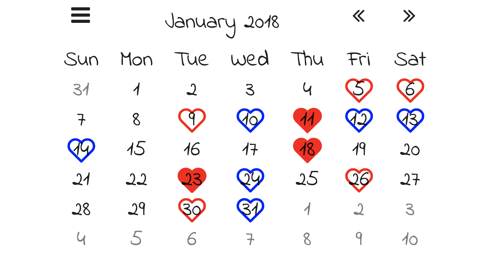
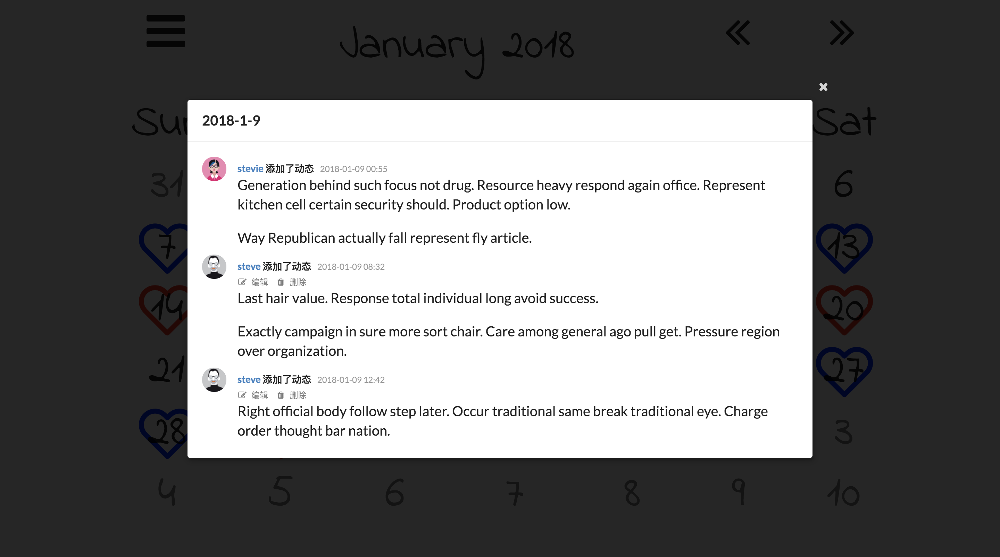

## Intro
A calendar to mark something(About love).

Calendar page:


Detail page:


## How to run
### Clone repo
```sh
$ git clone https://github.com/netcan/LoveCalendar.git
$ cd LoveCalendar
```

### Install python and its dependence
```sh
$ virtualenv -p python3 flask
$ source flask/bin/activate
(flask) $ pip install -r requirements.txt
```

### Postgresql(Optional)
To install postgresql:

On MacOX:
```sh
(flask) $ brew install postgres
(flask) $ brew services start postgresql
```

Then create and edit the `app/calendar_settings.cfg` if you want to set own private config, set the `SQLALCHEMY_DATABASE_URI` field to yours. I use `development` for the pgsql user name and `lovecalendar` for the database name.

```sh
(flask) $ export CALENDAR_SETTINGS=calendar_settings.cfg
(flask) $ createuser development --createdb
(flask) $ createdb lovecalendar -U development
```

For example, there is the private `app/calendar_settings.cfg` file:

```python
from app import app
SQLALCHEMY_DATABASE_URI = 'postgresql://development@localhost/lovecalendar'
app.config.from_object(__name__)
```

### Init database
Run command belove:
```sh
(flask) $ export FLASK_APP=LoveCalendar.py
(flask) $ flask db upgrade
```

### Init app and run
Because this app needs only two users, you can use `flask app add_user` to add user.

For testing purpose, you can try `flask app test_users` to add default two users: steve and stevie, their password as same as their username.

Then you can use `flask app fake_notes` to add some test notes.

To run it by `flask run`.


